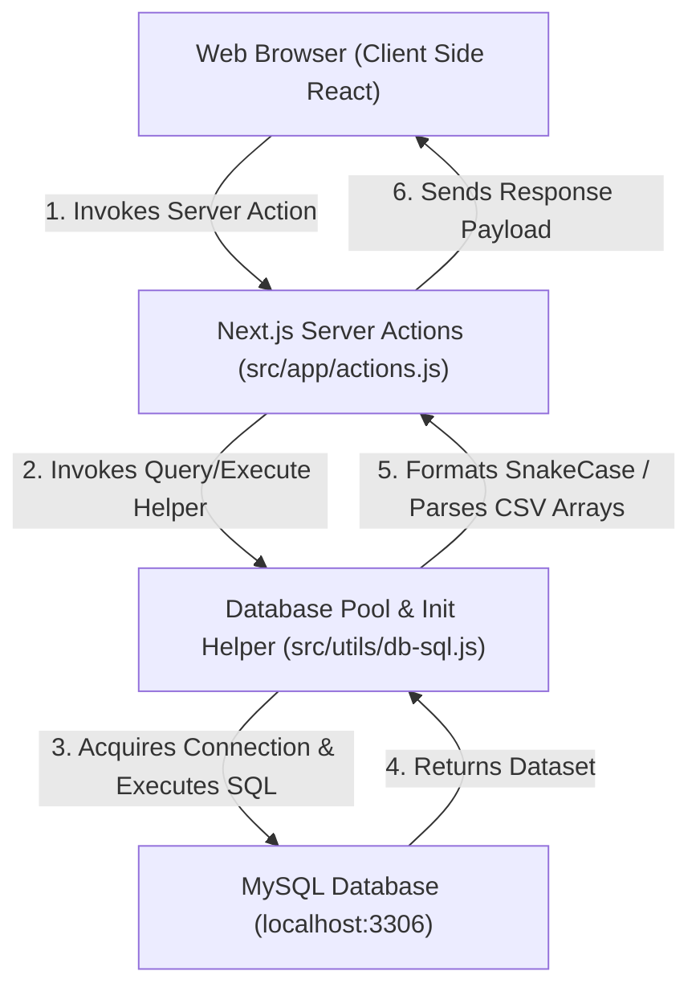
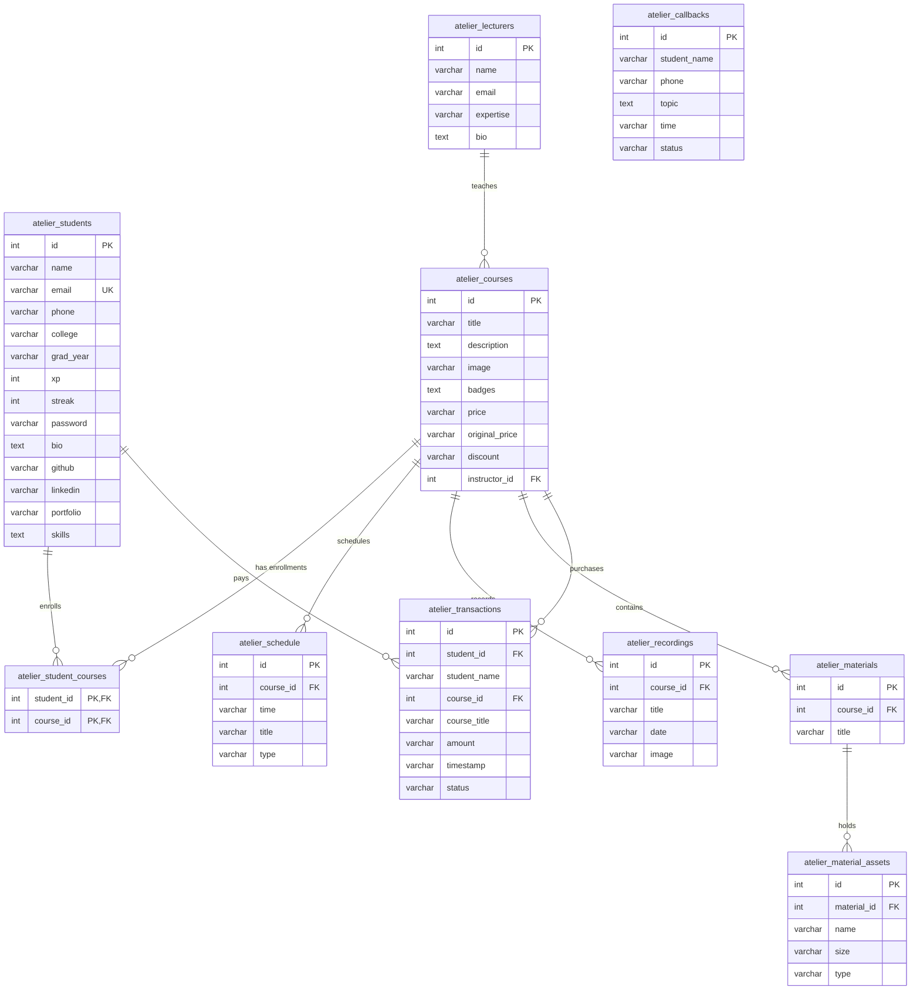
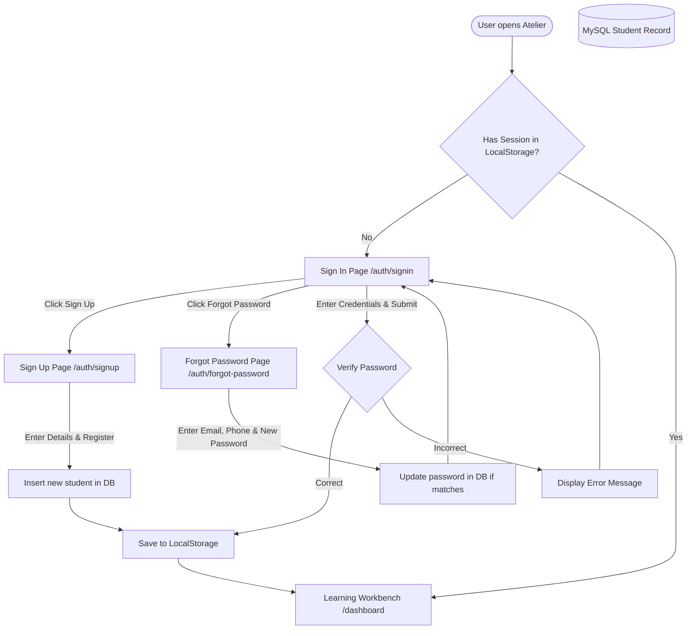

# 🐝 Atelier — The Sphere Hive Learning Workbench

Welcome to the **Atelier** platform, a high-fidelity, interactive cohort portal. This application integrates an administrative control dashboard, a student sandbox workbench, real-time mentorship hotlines, and a secure authentication center, all powered by a live **MySQL** relational database backend.

---

## 🗺️ System Architecture

The following flowchart outlines the end-to-end data lifecycle of the application, showing how React client-side states interact with Next.js Server Actions and connection-pooled MySQL databases.



---

## 🗃️ Database Entity Relationship Diagram (ERD)

All tables use the `atelier_` prefix to isolate database namespaces. The schema defines clear foreign keys and cascading rules to maintain database integrity:



---

## 🔐 Authentication & Session Flow

Atelier features an integrated session manager using LocalStorage to enforce authentication states and route guards.



---

## 🚀 Getting Started

### 1. Environment Configurations
Configure the local MySQL server parameters in the `.env.local` file inside the root directory:

```env
DB_HOST=localhost
DB_PORT=3306
DB_USER=root
DB_PASSWORD=your_mysql_password_here
DB_NAME=atelier

NEXT_PUBLIC_MASTER_SECURITY_KEY=ARSHAD-SAMVRUDHI
NEXT_PUBLIC_CLEARANCE_PASSWORD=noor
```

### 2. Install & Start Development Server
```bash
# Install dependencies
npm install

# Run the next.js development workspace
npm run dev
```
*Note: The MySQL database and all required tables are automatically created and seeded with default data profiles upon launching the application.*

---

## 🧪 Testing Credentials

### 🔐 Secure Admin Console
- **Route Link:** `/admin`
- **Verification Credentials:**
  - **Master Security Key:** `ARSHAD-SAMVRUDHI`
  - **Clearance Password:** `noor`

### 🎓 Student Dashboard Login
- **Route Link:** `/auth/signin`
- **Default Profile Credentials:**
  - **Student Email:** `jane.doe@atelier.com`
  - **Password:** `password`

---

## 📁 Route Catalog

- `/` — Premium brand landing page detailing features, cohort comparisons, and testimonials.
- `/courses` — Public course catalog displaying active cohort tracks loaded directly from the database.
- `/admin` — Secure console providing full CRUD management capabilities over students, courses, schedules, resources, callbacks, instructors, and transaction logs.
- `/admin/courses/[id]` — Detailed breakdown of registered students in a cohort, providing audit capabilities.
- `/admin/lecturers/[id]` — Lecturer profile showcasing assigned cohorts and active students metrics.
- `/auth/signin` — Authenticates student details against the MySQL student schema.
- `/auth/signup` — Registers new profiles and hooks up default courses.
- `/auth/forgot-password` — Password reset form validating email profiles.
- `/dashboard` — Learning workbench containing tech-tree pathways, sandbox environments, and callback hotlines.
- `/dashboard/explore` — Explore catalog allowing students to purchase tracks.
- `/dashboard/my-courses` — Workspace selector containing purchased programs.
- `/dashboard/live` — Timetables, live room class links, and recorded archives.
- `/dashboard/materials` — Downloadable PDF slide checklists and repository resources.
- `/dashboard/profile` — Student portfolio editor updates names, contacts, biography details, social URLs, and core skills lists.
