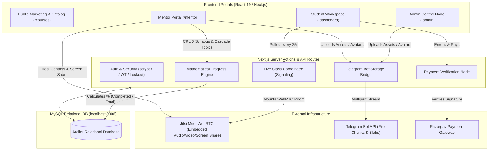
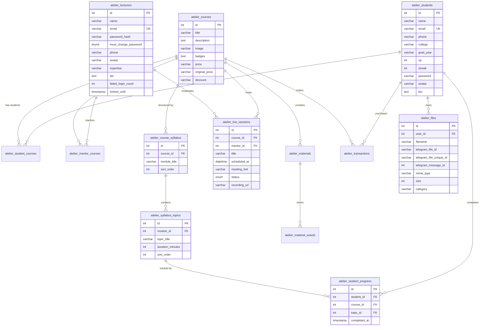

# 🐝 Atelier - Sphere Hive Academy Platform

> **High-Performance Engineering Cohorts, Live Mentorship, and Student Learning Ecosystem.**

Atelier is an enterprise-grade learning workbench and cohort management platform built with **Next.js 16 (Turbopack)**, **React 19**, and a resilient **MySQL** relational database. It features dedicated portals for students, mentors, and administrators, real mathematical curriculum progress calculation, a native embedded **WebRTC Live Classroom (Jitsi Meet)** with mentor host controls, and private backend file storage powered entirely by the **Telegram Bot API** (100% replacing third-party services like Cloudinary).

---

## ⚡ Core Tech Stack

- **Framework**: [Next.js 16.2.9](https://nextjs.org/) (App Router & Turbopack)
- **UI Engine**: [React 19.2.4](https://react.dev/)
- **Database**: MySQL 8.0+ via [`mysql2/promise`](https://github.com/sidorares/node-mysql2) connection pooling with idempotent migrations
- **File Storage**: Private Telegram Bot API storage backend with zero client-exposed secrets
- **Live Classroom**: Embedded Jitsi Meet WebRTC API with two-way audio, real-time in-room chat space, mentor screen sharing, and host moderation tools
- **Payment Gateway**: [Razorpay Node SDK](https://razorpay.com/) (order creation & HMAC SHA-256 signature verification)
- **Animations & Smooth Scroll**: [GSAP](https://greensock.com/gsap/) & [Lenis](https://lenis.darkroom.engineering/)
- **Authentication & Security**: Salted `scryptSync` cryptographic password hashing, timing-safe equality checks, JWT session tokens, and 15-minute brute-force lockout protection

---

## 🏛️ System Architecture



---

## 🗃️ Database Schema & Normalization (ERD)

All tables use the `atelier_` namespace with cascading foreign keys to preserve strict data integrity:



---

## 🌟 Key Platform Capabilities

### 1. 🎓 Student Learning Workspace (`/dashboard`)
- **Mathematical Progress Engine**: Progress is calculated as:
  $$\text{Progress \%} = \text{round}\left(\frac{\text{completed\_topics}}{\text{total\_topics}} \times 100\right)$$
  Derived from normalized syllabus tables. Completing 100% of curriculum topics automatically timestamps `atelier_student_courses.completed_at`.
- **Initials Avatar Badge**: Zero reliance on default stock images. Users without a uploaded avatar render an initials avatar (`<InitialsAvatar />`) with a deterministic color palette generated from their name.
- **Real-Time Live Classroom (`/dashboard/live`)**:
  - Automatically polls every 25 seconds for live mentor broadcasts.
  - One-click **"Join Live Classroom"** mounts the embedded theater room right on the page.
  - Two-way microphone audio to ask doubts, raise hand, and text in the in-class chat space.
- **Resource Materials**: Direct streaming downloads of course PDF slides, cheatsheets, and starter repositories.

### 2. 👨‍🏫 Mentor Portal & Workspace (`/mentor`)
- **Enterprise Security**: Salted `scryptSync` password hashing with timing-attack mitigation, 5-attempt/15-minute brute-force lockout, and mandatory password reset on initial sign-in.
- **Ownership Gating**: Mentors are strictly authorized to view only their assigned cohorts (`assertMentorOwnsCourse`).
- **4-Tab Cohort Studio (`/mentor/courses/[id]`)**:
  1. **Enrolled Students**: Student directory with contact details and real-time curriculum progress bars.
  2. **Live Classes**: Schedule sessions, start live broadcasts with concurrency prevention (maximum 1 active live class per mentor), enter the **Broadcast Studio**, and conclude classes with recorded replay URLs.
  3. **Syllabus Manager**: Add, edit, and delete modules and curriculum topics (deleting a topic automatically cascades and recalculates student percentages).
  4. **Course Materials**: Create resource folders and upload files directly.
- **Host / Moderator Controls**:
  - **Mute All Participants (`mute-everyone`)**: Instantly silence attendee microphones.
  - **Kick Disruptive Students**: Eject any attendee from the classroom.
  - **Screen Sharing**: Broadcast code editors and browser windows in HD.
  - **In-Room Chat**: Real-time discussions during live sessions.

### 3. 🛡️ Admin Console (`/admin`)
- Accessible via dual-clearance security keys (`NEXT_PUBLIC_MASTER_SECURITY_KEY` / `NEXT_PUBLIC_CLEARANCE_PASSWORD`).
- **Mentor Provisioning**: Register mentors, assign one or more cohorts, and receive an auto-generated temporary password to share securely.
- **Complete CRUD Management**: Students, courses, live timetables, material assets, hotline callback requests, and Razorpay transaction logs.

### 4. 📦 Zero-Cloudinary File Storage (Telegram Bot API)
- Uploaded avatars and course materials are streamed to a private Telegram channel via the Telegram Bot API (`TELEGRAM_BOT_TOKEN`, `TELEGRAM_STORAGE_CHAT_ID`).
- Supports files up to **50 MB**.
- All secrets remain on the server; the client interacts solely with sanitized Next.js proxy endpoints (`/api/files/[id]`, `/api/files/upload`).

---

## 🚀 Environment Configuration

Create a `.env.local` file in the root directory:

```env
# ── 1. Application & Domain URLs ──
NEXT_PUBLIC_APP_URL=http://localhost:3000
NEXT_PUBLIC_SITE_URL=https://atelier.spherehive.com

# ── 2. MySQL Database Connection ──
DB_HOST=localhost
DB_PORT=3306
DB_USER=root
DB_PASSWORD=your_mysql_password
DB_NAME=atelier

# ── 3. Telegram Bot API Storage (Server-side only) ──
TELEGRAM_BOT_TOKEN=your_bot_token_here
TELEGRAM_STORAGE_CHAT_ID=your_channel_chat_id_here

# ── 4. Session & Mentor JWT Security ──
SESSION_SECRET=a_strong_random_32_character_secret_here

# ── 5. Admin Console Security Keys (Optional overrides) ──
NEXT_PUBLIC_MASTER_SECURITY_KEY=ARSHAD-SAMVRUDHI
NEXT_PUBLIC_CLEARANCE_PASSWORD=noor

# ── 6. Razorpay Payment Gateway (Optional) ──
RAZORPAY_KEY_ID=
RAZORPAY_KEY_SECRET=

# ── 7. Social OAuth Sign-In (Optional) ──
GOOGLE_CLIENT_ID=
GOOGLE_CLIENT_SECRET=
GITHUB_CLIENT_ID=
GITHUB_CLIENT_SECRET=
```

---

## 🛠️ Getting Started

### 1. Install Dependencies
```bash
npm install
```

### 2. Launch Development Server
```bash
npm run dev
```
*Note: All MySQL database tables, composite indexes, and normalized syllabus seeds are initialized automatically upon launch.*

### 3. Production Build & Verification
```bash
npm run build
npm run start
```

---

## 🧪 Testing Credentials

| Portal | Route | Default Credentials |
| :--- | :--- | :--- |
| **Admin Console** | `/admin` | Security Key: `ARSHAD-SAMVRUDHI`<br>Password: `noor` |
| **Mentor Portal** | `/mentor/login` | Email: `mentor@atelier.io` (or any email registered by Admin)<br>Password: `mentor123` (Prompts password reset upon initial login) |
| **Student Workspace** | `/auth/signin` | Email: `jane.doe@atelier.com`<br>Password: `password` |

---

## 🧭 Public Route & SEO Sitemap

- `/` - Landing page with SEO metadata and educational organization JSON-LD schema
- `/courses` - Cohort tracks catalog with category filters and search
- `/courses/[id]` - Dynamic course details page with Course JSON-LD schema and OpenGraph previews
- `/contact` - Admissions counseling and callback request form
- `/privacy-policy` - Data handling, transaction terms, and privacy disclosures
- `/refund-policy` - Pricing, cancellation, and refund policies
- `/terms` - Code of conduct and enrollment terms of service
- `/sitemap.xml` - Dynamic sitemap with priority ratings for search engines
- `/robots.txt` - SEO robots configuration allowing public indexation while securing private dashboards

---

## 📄 License

Proprietary and confidential. Developed for **Atelier - Sphere Hive Academy**. All rights reserved.
